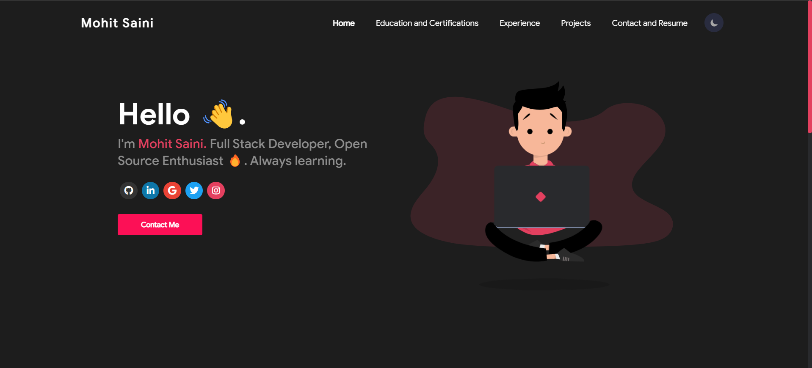

# Personal-Portfolio

## Description 📝

<p>Welcome to my personal portfolio! I've organized my portfolio into different categories to make it easy for you to find what you're looking for. I hope you enjoy browsing through my portfolio and getting to know more about me. If you have any questions or would like to get in touch, don't hesitate to reach out to me.</p>

You can check the site by clicking here - <a href="https://msaini0r.github.io/PortfolioV2/">Link</a>

## Setup

<hr>
<br>
<p>1. Use the below command to install project dependenices. And use node version 16.16.0 or 16.x.x</p>

```
npm i --force
```

 <br>
<p>2. We are using <a href="https://www.pluralsight.com/guides/deploying-github-pages-with-create-react-app">gh-pages</a> for deployment so make sure to run this command to deploy these changes.</p>

```
npm run deploy
```

## Preview ✅

<hr>
<table style="border:1px solid;">
<!--   <tr >
    <th style="text-align: center; border:1px solid;"> Preview </th>
  </tr> -->
  <tr >
    <p align="center"; style="text-align: center; border:1px solid;padding:1em;">
        
    </p>
  </tr>
</table>
<hr>

<h1 align="center">⚡Connect with me⚡</h1>

<p align="center">
   <a href="https://www.linkedin.com/in/msaini0r/">
		
	</a>
  	<a href="https://twitter.com/msaini0r">
		
	</a>
	<a href="mailto:msaini0r@gmail.com">
		
	</a>
    <a href="https://leetcode.com/msaini1r/">
		
	</a>
</p>
